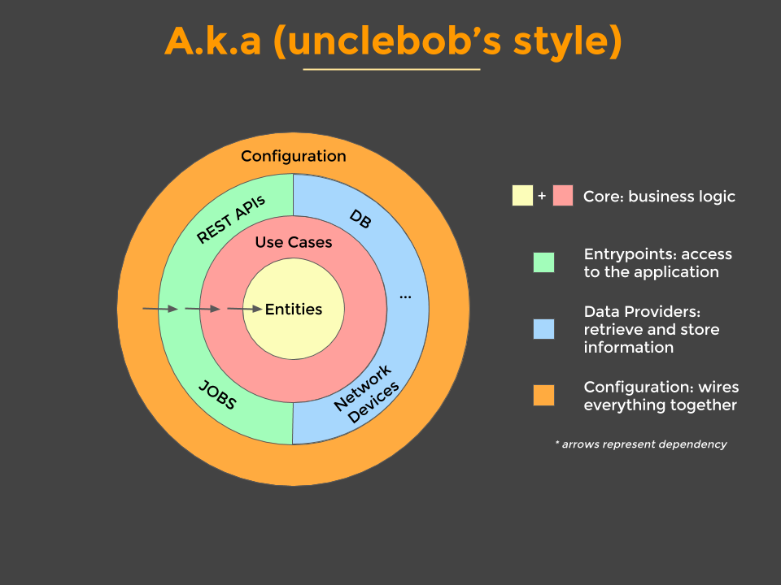
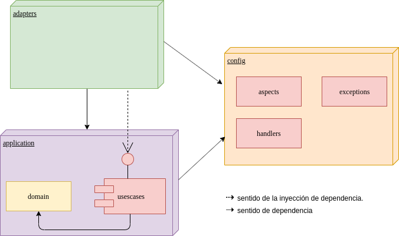

# Backend for frontend - Seed


Esta basado en el principio de Clean Architecture.



## Estructura de paquetes

Se definió la siguiente taxonomía de paquetes:

   * **application:** Encapsula toda la lógica de negocio y el modelo del dominio.
        * **domain:** Contiene entidades del dominio. Representa el nucleo de toda la aplicación.
        * **usescases:** Abstracción de los casos de uso del sistema. Contiene además la definición de los puertos y excepciones.
   * **adapters:** Representa la capa de adaptadores (como su nombre indica) que se conectarán en los puertos expuestos por el sistema
   * **config:** Capa transversal a toda la aplicación que contendrá las distintas configuraciones y aspectos del bff.
        



## Java Version
La version que java que se va a utilizar es la 11.0.5 basada en el OpenJDK.

Esta la pueden descargar [aqui](https://github.com/AdoptOpenJDK/openjdk11-upstream-binaries/releases/tag/jdk-11.0.5%2B10).
También se puede instalar usando [SdkMan](https://sdkman.io/), version 11.0.5-open.

## Swagger
### Swagger json
http://localhost:8080/api/v2/api-docs

### Swagger UI
http://localhost:8080/swagger-ui.html

## Tasks
### Build docker y push al registry

Ejecutar el siguiente task haciendo uso del gradle wrapper.

```
  docker build -t {registry}/seed/bff/bff-seed:0.0.1 .
  docker push {registry}/seed/bff/bff-seed:0.0.1
```

### Jacoco - Sonar
```
./gradlew jacocoTestReport sonarqube
```

### OAUTH2 Ambiente local
Para que el servicio de oauth2 no nos pida un token al momento de las pruebas local se debe levantar el proyecto con el profile "local"

Puede realizarse de 2 maneras: 

* Colocando en la configuracion del booteo del IDE en las "VM Options" la siguiente opcion:
* Ejecutando desde las Tasks de gradle la tarea bootRun y teniendo en los jvmArgs la siguiente opcion: 
```
    **-Dspring.profiles.active=local**
```

Y luego en el application-local.properties existe una propiedad llamada 
``rut.local.oauth`` la cual se utiliza para colocar el rut con el que se quiere probar la funcionalidad.
